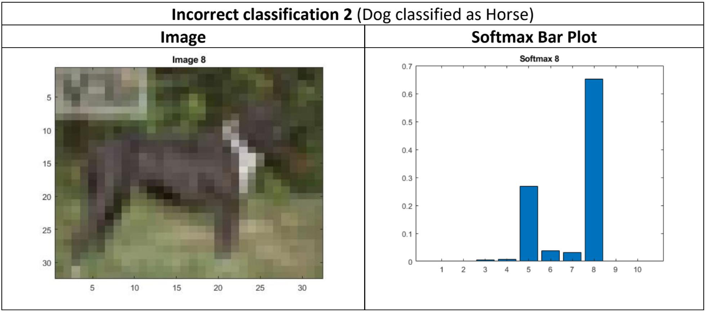
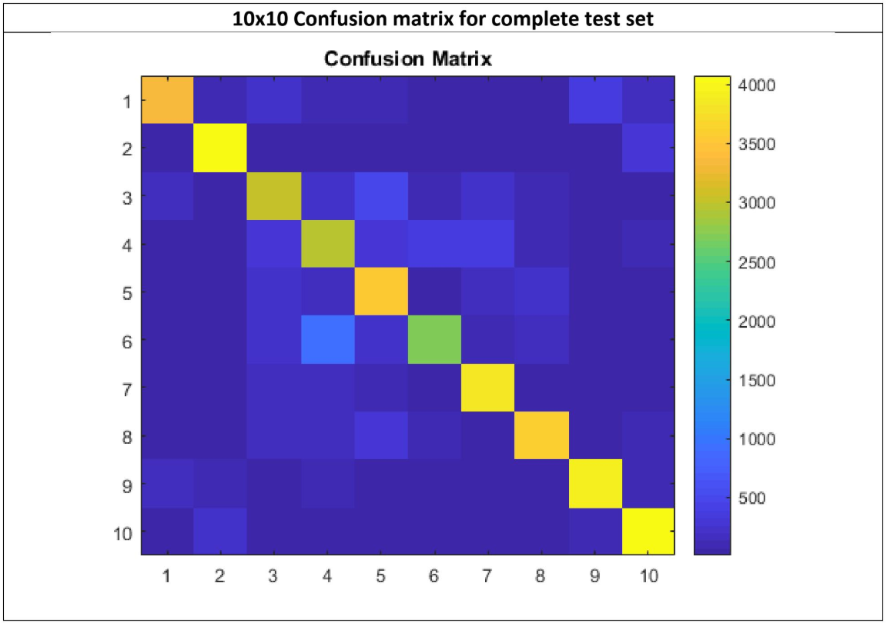

# Convolutional-Neural-Network

The <b>convolutional neural network</b> shown in <b>figure 1</b> is constructed in MATLAB and applied in image recognition and image classification. This neural network uses the Cifar-10 training image set. The trained model is tested using the image test sets. Three correct classification and three incorrect classifications are shown below. The confusion matrix shown can be used to estimate the performance of this neural network.

#### Dataset: Cifar-10 dataset
#### Model Training Using Cifar-10 training data
#### Objective: Correct classification of test data

## ConvNet Architecture

## Training Model

## Result for Final Iteration

## Image CLassification Results

## Correct Classification

## Incorrect Classifications

## Confusion Matrix

